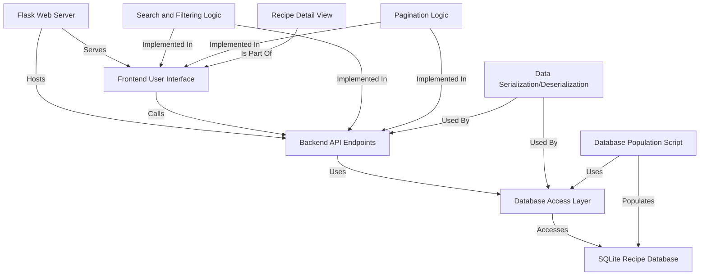
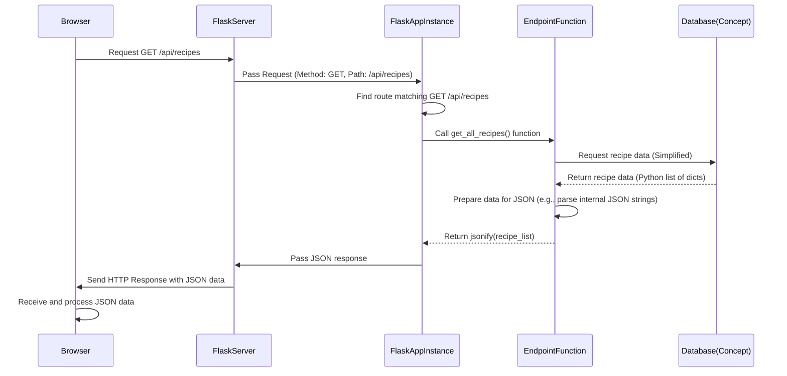
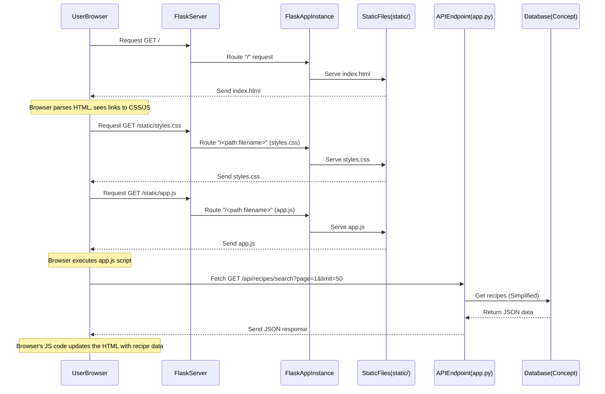
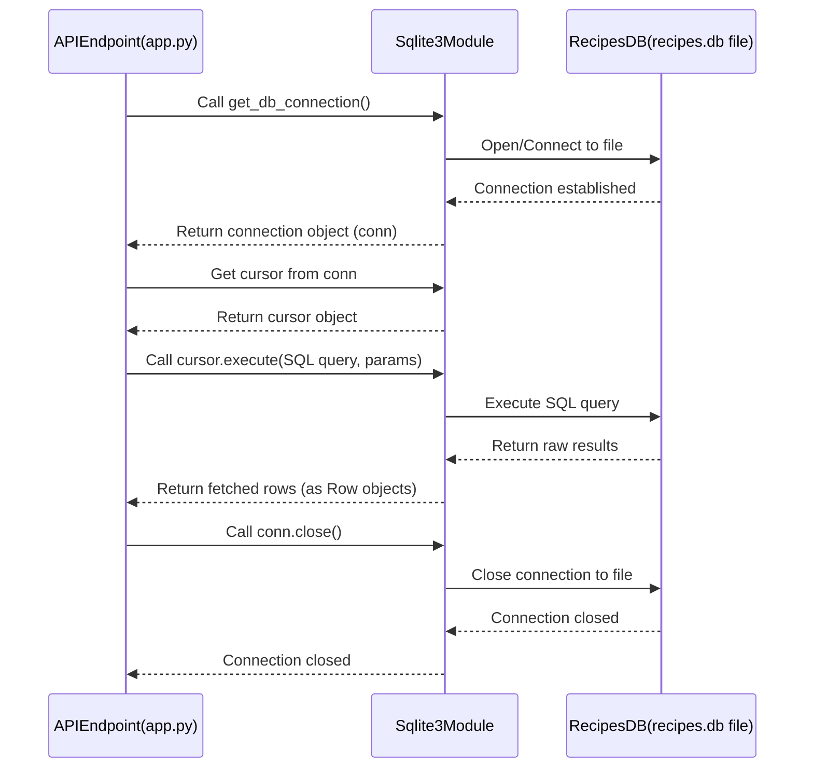
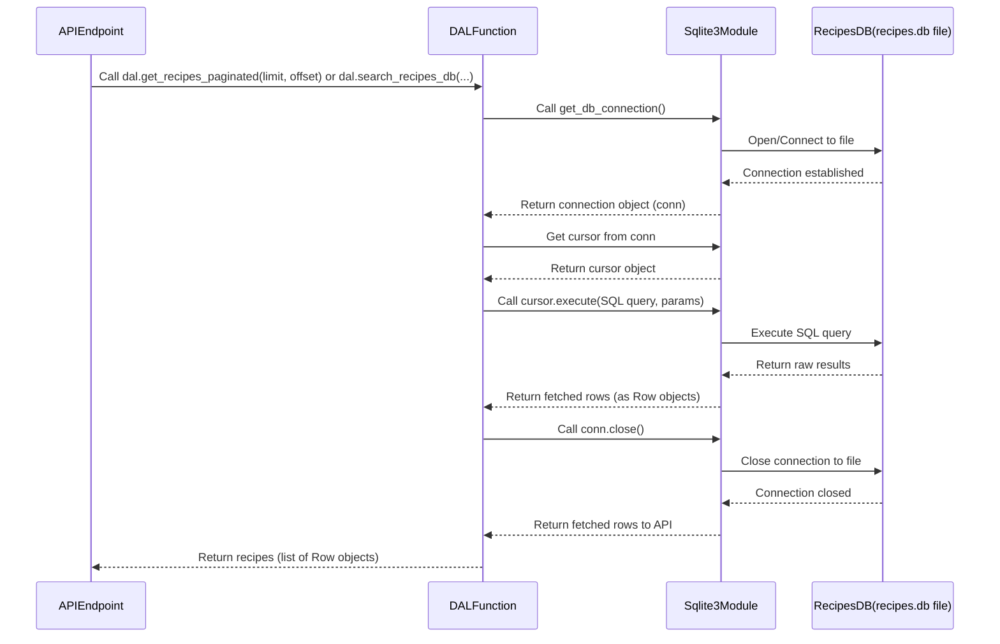
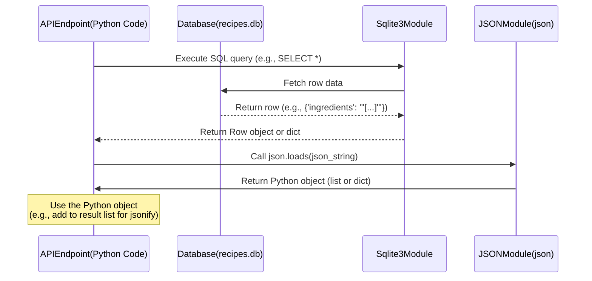

# Recipe API Development

# Tutorial: Recipe-API-development

This project is a **web application** for browsing recipes.
It uses a **Flask backend** to serve a simple **frontend** user interface and
provide **API endpoints** that allow searching, filtering, and
paginating recipes stored in an *SQLite database*.
The frontend handles user interaction, displaying recipe lists,
and showing *detailed views* for individual recipes.


## Visual Overview



## Chapters

1. Flask Web Server
2. Backend API Endpoints
3. Frontend User Interface
4. SQLite Recipe Database
5. Database Access Layer
6. Data Serialization/Deserialization


# Chapter 1: Flask Web Server

Welcome to the first chapter of our Recipe API development tutorial! We're starting our journey by understanding the very heart of our backend application: the web server.

Think of a web server like the main office for your website or application. When you type a web address (like `google.com` or `localhost:5000`) into your browser and press Enter, you're sending a request, like placing an order at this office. The web server is the one listening for these requests.

In our project, the web server's job is to:
1.  **Listen** for requests coming from your web browser (the "customer").
2.  **Receive** those requests (like "Show me the main page!" or later, "Give me recipes matching 'pie'").
3.  **Process** the request (figure out what the user is asking for).
4.  **Find or create** the right information or content.
5.  **Send back** a response to your browser (like the main page HTML, or a list of recipes).

Our project uses **Flask** to build this web server. Flask is a popular and beginner-friendly web framework for Python. A "web framework" is essentially a set of tools and guidelines that make it easier to build web applications. Flask is often called a "micro" framework because it provides the essentials without forcing too many decisions on you, making it great for learning and building smaller applications like ours.

## Our First Goal: Serving the Main Page

The most basic thing a web server needs to do is serve the main page of the website. In our project, when you go to `http://localhost:5000`, the server needs to send back the `index.html` file, which is the starting point for our frontend user interface.

How does Flask help us do that?

## Key Flask Concepts

Let's break down the core ideas behind creating a simple Flask server:

1.  **The Flask Application Instance:** This is like creating the "main office" itself. You need an object that represents your web application.
2.  **Routes:** These are like the different "departments" or "service windows" in the office. A route tells the Flask application which piece of code should run when a specific web address (URL path) is requested. For example, `/` is the route for the main page, and `/api/recipes` is a route for getting recipe data (we'll cover 02_backend_api_endpoints_.md later).
3.  **Request Handling Functions:** These are the "workers" in each department. When a request comes in for a specific route, Flask runs the Python function associated with that route. This function does the work (like finding a file or querying the database).
4.  **Responses:** This is what the worker sends back to the customer. The request handling function returns something (like HTML text, data in JSON format, or a file) that Flask packages up and sends back to the user's browser.
5.  **Running the Server:** This is like opening the office for business. You need to tell Flask to start listening for incoming requests on a specific address and port (like `localhost:5000`).


# Chapter 2: Backend API Endpoints

Welcome back! In Chapter 1: Flask Web Server, we learned that our Flask application is a server that listens for requests from your browser. It's like the main office receiving mail or phone calls. We saw how it handles basic requests like `/` to send back the main `index.html` file.

But what about getting the actual *recipe data*? How does the frontend ask the backend for a list of recipes, or search for specific ones? This is where **Backend API Endpoints** come in.

## What are API Endpoints?

Think of our web server like a library. You can go to the main desk (the `/` route) to get directions or access general information. But to find a specific book (or a list of books), you need to go to a specific section or counter dedicated to finding books.

In our web application, API Endpoints are those "specific counters" or "sections" dedicated to providing data or performing specific actions. They are unique addresses (URLs) on our server that the frontend uses to communicate and exchange data.

For our Recipe API, the frontend needs to:

1.  Get a list of all recipes (maybe paginated).
2.  Search for recipes based on criteria like title or cuisine.

Each of these tasks will correspond to a specific API endpoint.

An API endpoint is defined by two main things:

1.  **The URL Path:** This is the unique part of the web address that comes after the server's base address (like `http://localhost:5000`). For example, `/api/recipes` or `/api/recipes/search`.
2.  **The HTTP Method:** This indicates the *type* of action the client wants to perform. The most common methods are:
    *   `GET`: Request data from the server. (Like asking for a book).
    *   `POST`: Send data to the server to create something new. (Like submitting a new recipe).
    *   `PUT`: Send data to the server to update something existing. (Like editing a recipe).
    *   `DELETE`: Ask the server to remove something. (Like deleting a recipe).

In this chapter, we'll focus mainly on the `GET` method, as it's used by the frontend to retrieve recipe data for display and searching.

## Defining Endpoints with Flask Routes

In Flask, we define API endpoints using the same `@app.route()` decorator we saw in Chapter 1, but with a specific URL path for the API and by specifying the allowed HTTP methods using the `methods` argument.

Let's see a very simple example, not tied to recipes yet, just to illustrate:

```python
from flask import Flask, jsonify

app = Flask(__name__)

@app.route('/api/greeting', methods=['GET'])
def hello_world():
    # This function runs when someone requests GET /api/greeting
    return jsonify({"message": "Hello, API!"})

# (Rest of the app setup and run code would go here)
```

-   `@app.route('/api/greeting', methods=['GET'])`: This line tells Flask: "When a `GET` request comes in for the path `/api/greeting`, run the `hello_world` function."
-   `def hello_world():`: This is the function that handles the request.
-   `return jsonify({"message": "Hello, API!"})`: Instead of returning HTML like we did for the main page, we return data. The `jsonify` function from Flask is super helpful here. It takes a Python dictionary (or list) and converts it into a standard data format called **JSON** (JavaScript Object Notation), which is the common language for APIs. It also sets the correct headers for the HTTP response.

If you were to run this tiny app and go to `http://localhost:5000/api/greeting` in your browser (browsers perform GET requests by default), you would see something like:

```json
{
  "message": "Hello, API!"
}
```

This is the JSON data returned by our endpoint.

## Our Recipe API Endpoints

Looking at the project's README, you'll see the planned API endpoints:

| Endpoint                                      | Method | Description                          |
| :-------------------------------------------- | :----- | :----------------------------------- |
| `/api/recipes`                                | `GET`  | Fetch all recipes (with pagination)  |
| `/api/recipes/search`                         | `GET`  | Search recipes by title/cuisine etc. |
| `/api/recipes/title/<title>`                  | `GET`  | Fetch one recipe by exact title      |
| `/api/recipes/cuisine?cuisine=<cuisine>`     | `GET`  | Fetch recipes by exact cuisine       |

Notice they all start with `/api/recipes`. This is a common convention to group related API endpoints.

Let's look at how the `/api/recipes` endpoint is defined in our `app.py`.

```python
# --- app.py snippet ---
# ... other imports and app setup ...

@app.route('/api/recipes', methods=['GET'])
def get_all_recipes():
    # This function will handle GET requests to /api/recipes
    # It needs to get data from the database and return it as JSON
    pass # Placeholder - the actual logic is more complex

# ... rest of the file ...
```

This code sets up the endpoint. When a `GET` request arrives at `/api/recipes`, Flask will call the `get_all_recipes()` function.

Now, how does the `get_all_recipes` function *get* the recipes and *return* them as JSON?

## Handling the Request and Returning Data

Inside the function that handles an API endpoint request, we typically perform the following steps:

1.  **Get any necessary information from the request:** This might include data sent in the request body (for `POST`/`PUT`), parameters in the URL path (like `<title>` in `/api/recipes/title/<title>`), or parameters in the URL query string (like `?page=1&limit=10`).
2.  **Perform the required logic:** For a `GET` request, this means fetching data, usually from a database. For other methods, it could be saving data, updating records, etc. (The details of database interaction are covered in SQLite Recipe Database. and Database Access Layer.
3.  **Prepare the response data:** Gather the data retrieved in step 2 into a Python structure like a list of dictionaries.
4.  **Convert and return the data:** Use `jsonify()` to convert the Python data structure into a JSON response and return it.

Let's look at a simplified flow for the `/api/recipes` endpoint using a sequence diagram:



This diagram shows how the request travels from the browser to the Flask server, gets routed to the correct Python function (`get_all_recipes`), that function interacts (conceptually) with the database, prepares the data, and sends it back as JSON.

## Diving into the `app.py` Code

Now let's look at the actual code for a couple of the `GET` endpoints in `app.py` to see how these steps are implemented.

First, the `/api/recipes` endpoint for fetching *all* recipes (with pagination support):

```python
# --- app.py snippet ---
# ... other code ...

@app.route('/api/recipes', methods=['GET'])
def get_all_recipes():
    # 1. Get info from request (query parameters for pagination)
    page = int(request.args.get('page', 1)) # Get 'page' parameter, default to 1
    limit = int(request.args.get('limit', 10)) # Get 'limit' parameter, default to 10
    offset = (page - 1) * limit # Calculate offset for database query

    # 2. Perform logic (get data from database)
    conn = get_db_connection() # Get database connection (Details in later chapters)
    cursor = conn.cursor()
    cursor.execute("SELECT * FROM recipes LIMIT ? OFFSET ?", (limit, offset)) # SQL query with pagination
    recipes = cursor.fetchall() # Get the results
    conn.close() # Close database connection

    # 3. Prepare response data & 4. Convert/Return
    result = []
    for recipe in recipes:
        recipe_dict = dict(recipe) # Convert row object to dictionary
        # Deserialize JSON fields stored as strings in DB (More on this later)
        recipe_dict['ingredients'] = json.loads(recipe_dict['ingredients'])
        recipe_dict['instructions'] = json.loads(recipe_dict['instructions'])
        recipe_dict['nutrients'] = json.loads(recipe_dict['nutrients'])
        result.append(recipe_dict)

    return jsonify(result) # Convert list of dicts to JSON and return

# ... rest of the file ...
```

-   `@app.route('/api/recipes', methods=['GET'])`: Again, this maps `GET /api/recipes` requests to `get_all_recipes`.
-   `request.args.get('page', 1)` and `request.args.get('limit', 10)`: The `request` object (imported from `flask`) holds information about the incoming request. `request.args` is a dictionary-like object containing parameters from the URL query string (like `?page=2&limit=5`). `.get('page', 1)` safely retrieves the value for `page` (or returns `1` if not provided) and converts it to an integer. 
-   `conn = get_db_connection()`: This line calls a function to connect to our database. The specifics of this are covered in Database Access Layer.
-   `cursor.execute(...)` and `cursor.fetchall()`: These are database operations to run an SQL query and get the results. 
-   `json.loads(...)`: The recipe data includes lists (like ingredients) and nested objects (like nutrients) that were stored in the database as text strings containing JSON. We need to convert these strings back into Python lists/dictionaries using `json.loads()` before sending them in the JSON response. T
-   `return jsonify(result)`: The final step, sending the list of recipe dictionaries back as a JSON response.

Next, let's look at the `/api/recipes/search` endpoint:

```python
# --- app.py snippet ---
# ... other code ...

@app.route('/api/recipes/search', methods=['GET'])
def search_recipes():
    # 1. Get info from request (query parameters for search criteria)
    title = request.args.get('title', default=None, type=str)
    cuisine = request.args.get('cuisine', default=None, type=str)
    # ... get other potential search parameters like rating, total_time, serves ...
    page = int(request.args.get('page', 1)) # Pagination parameters again
    limit = int(request.args.get('limit', 10))
    offset = (page - 1) * limit

    # 2. Perform logic (build database query based on parameters)
    conn = get_db_connection()
    cursor = conn.cursor()

    query = "SELECT * FROM recipes WHERE 1=1" # Base query
    params = [] # List to hold parameters for the query

    # Add conditions based on provided parameters
    if title:
        query += " AND title LIKE ?" # Add condition to SQL
        params.append(f"%{title}%") # Add value for the condition
    if cuisine:
        query += " AND cuisine = ?"
        params.append(cuisine)
    # ... add conditions for rating, total_time, serves ...

    query += " LIMIT ? OFFSET ?" # Add pagination to the query
    params.extend([limit, offset])

    cursor.execute(query, params) # Execute the dynamic query
    recipes = cursor.fetchall()
    conn.close()

    # 3. Prepare response data & 4. Convert/Return
    result = []
    for recipe in recipes:
        recipe_dict = dict(recipe)
        # Deserialize JSON fields
        for key in ['ingredients', 'instructions', 'nutrients']:
             if key in recipe_dict and recipe_dict[key]:
                 recipe_dict[key] = json.loads(recipe_dict[key])
        result.append(recipe_dict)

    return jsonify(result) # Return search results as JSON

# ... rest of the file ...
```

-   `@app.route('/api/recipes/search', methods=['GET'])`: This maps `GET /api/recipes/search` requests to the `search_recipes` function.
-   `request.args.get('title', default=None, type=str)`: Again, we use `request.args` to get query parameters like `?title=pie` or `?cuisine=Italian`. `default=None` means if the parameter isn't provided, the variable will be `None`. `type=str` ensures it's treated as a string.
-   The code then dynamically builds an SQL query (`query`) and a list of values (`params`) based on which parameters were provided in the request. 
-   The database interaction and JSON deserialization steps are similar to `get_all_recipes`.

We also have endpoints like `/api/recipes/title/<title>` and `/api/recipes/cuisine` which work similarly but might get parameters differently (`<title>` is a path parameter, `cuisine` is a query parameter in this specific route) and execute different database queries. You can see their definitions in `app.py`.

## Conclusion

In this chapter, we learned that Backend API Endpoints are specific URLs on our server designed for the frontend (or other clients) to request data or trigger actions. We saw how Flask's `@app.route()` decorator is used to define these endpoints, mapping URL paths and HTTP methods (like `GET`) to specific Python functions. These functions handle the request by getting necessary information (like query parameters), performing logic (like fetching data from a database), and returning the results as JSON data using `jsonify()`.

Understanding these endpoints is crucial because they form the communication contract between our backend server and the frontend user interface. In the next chapter, we will switch our focus to the frontend and see how it uses these API endpoints to fetch and display the recipe data for the user.


# Chapter 3: Frontend User Interface

Welcome back! In the previous chapters, we built the foundation of our backend application. In Chapter 1: Flask Web Server, we learned how our Flask server listens for requests and serves files like `index.html`. Then, in Chapter 2: Backend API Endpoints, we saw how the backend provides specific "doors" (`/api/recipes`, `/api/recipes/search`) that other applications can use to get data, usually in JSON format.

But where does all this happen? How do *you*, the user, actually see the recipes, type in your search terms, and click buttons? This is the job of the **Frontend User Interface**.

## What is the Frontend User Interface?

Imagine you walk into a store. The products are the data (our recipes), and the stockroom/warehouse is like our backend database and server logic. The Frontend User Interface is **everything you see and interact with on the store floor:**

*   **The display windows:** Showing enticing products (the recipe list).
*   **The shelves:** Organizing products (the table structure displaying recipes).
*   **The price tags and descriptions:** Giving you details about each product (recipe details).
*   **The interactive kiosks or order forms:** Where you can search for products, filter them, or place an order (the search bar, filter inputs, pagination buttons).

In our web application, the frontend runs entirely in your web browser. It's built using standard web technologies:

1.  **HTML (HyperText Markup Language):** Provides the structure and content of the page. It's like the blueprint and basic walls of the store. It defines headings, paragraphs, tables, input boxes, buttons, etc.
2.  **CSS (Cascading Style Sheets):** Controls how the HTML elements look – colors, fonts, layout, spacing. It's like the interior design, painting, and display arrangements in the store.
3.  **JavaScript:** Adds interactivity and dynamic behavior. It's like the store staff who help you search, answer questions, or process your order. JavaScript can change the HTML, update the CSS, respond to button clicks, and, crucially, communicate with our backend API.

Our goal in this chapter is to understand how these pieces work together to show you the recipe list, let you interact with filters and pagination, and display recipe details.

## How the Frontend Gets Recipes

The core task of our frontend is to display recipes. Since the backend is the source of truth for recipe data, the frontend needs to ask the backend for it. This is where the Backend API Endpoints we discussed come into play.

When you open `http://localhost:5000` in your browser, here's a simplified sequence of events involving the frontend:

1.  Your browser requests `/` from the Flask server.
2.  The Flask server responds by sending the `static/index.html` file 
3.  Your browser starts reading `index.html`.
4.  `index.html` contains links to `static/styles.css` and `static/app.js`. Your browser requests these files from the server.
5.  The server sends `styles.css` and `app.js` (again, via the static file serving route from Chapter 1).
6.  Your browser applies the styles from `styles.css` to the page structure defined in `index.html`.
7.  Your browser starts executing the JavaScript code in `app.js`.
8.  The JavaScript code in `app.js` initiates a request to one of the backend API endpoints, like `/api/recipes/search`, often including parameters for pagination or filters.
9.  The backend receives this request, processes it (fetches data from the database, as we'll see in later chapters), and sends back the recipe data as a JSON response Chapter 2: Backend API Endpoints.
10. The JavaScript code in `app.js` receives the JSON data from the backend.
11. The JavaScript code takes this data and dynamically builds the HTML elements needed to display the recipe list (e.g., creates rows in a table).
12. The JavaScript code updates the appropriate part of the `index.html` page in your browser to show the newly created HTML containing the recipes.

Let's visualize this initial loading process:



This diagram illustrates how the frontend code (`app.js`) running in the browser is responsible for fetching data from the backend API and dynamically updating the web page.

## Conclusion

In this chapter, we shifted our focus to the **Frontend User Interface**, the part of the application that runs in your browser and allows you to interact with the application. We learned that it's built using HTML for structure, CSS for styling, and JavaScript for interactivity. The key role of the JavaScript code is to communicate with the backend API endpoints (that we discussed in Chapter 2: Backend API Endpoints using `fetch` requests, receive the recipe data in JSON format, and dynamically update the HTML page to display that data to the user.

Understanding the frontend helps us appreciate why the backend API endpoints are structured the way they are – they are designed to provide the data the frontend needs to function.

Now that we know how the server works and how the frontend talks to it, let's explore where the recipe data actually comes from and how it's stored: the database.


# Chapter 4: SQLite Recipe Database

Welcome back to our Recipe API development journey! In the last couple of chapters, we saw that our Flask Web Server serves the static files for the frontend and that the backend provides  that the frontend uses to ask for recipe data.

But where does the backend *get* all this recipe data? We're talking about thousands of recipes! We can't just keep them all in Python variables that disappear when the server stops. We need a permanent place to store them, organized in a way that's easy for the backend to search and retrieve.

This is where the **SQLite Recipe Database** comes in.

## The Central Recipe Book: `recipes.db`

Imagine you have a massive collection of recipe cards. If they were just piled up randomly, finding a specific recipe would be impossible. You'd organize them into categories, maybe put them in a filing cabinet, and perhaps even use an index.

Our SQLite database, stored in a single file named `recipes.db`, is like that organized digital recipe book. It's the central storage place for every single recipe in our application.

### What is SQLite?

**SQLite** is a very popular type of database that is **file-based**. This means the entire database is stored in a single file on your computer (like `recipes.db`). Unlike larger database systems that require a separate server process running constantly, SQLite is "embedded" – the code that manages the database runs directly within our Python application when needed.

This makes SQLite incredibly simple to set up and use, especially for smaller applications like ours, or for development and testing. You don't need to install a separate database server! Python even includes built-in support for SQLite.

## How Data is Organized in a Database

Databases like SQLite store information in a structured way, typically using **tables**. Think of a table like a single spreadsheet:

*   **Table:** The whole spreadsheet itself (e.g., our "Recipes" table).
*   **Column:** A single vertical column in the spreadsheet, representing a specific type of information (like "Title", "Cuisine", "Rating"). Each item in that column for every row is the same type of data.
*   **Row:** A single horizontal row in the spreadsheet, representing one complete item (in our case, one full recipe). It contains a value for each column.

Our `recipes.db` database will contain one main table, also likely called `recipes`.

### The `recipes` Table Structure

Based on the project details, our `recipes` table needs columns to hold the key information for each recipe. Here's a look at the structure (similar to the one defined in the `load_recipes_to_db.py` script):

| Column Name   | Data Type (Simplified) | Description                                     |
| :------------ | :--------------------- | :---------------------------------------------- |
| `id`          | Integer                | Unique number for each recipe (like a primary key) |
| `title`       | Text                   | The name of the recipe                          |
| `cuisine`     | Text                   | The type of cuisine (e.g., "Italian", "Asian") |
| `rating`      | Number (Decimal)       | The user rating (e.g., 4.5)                     |
| `total_time`  | Text                   | Total time needed (e.g., "1 hr 30 min")         |
| `serves`      | Text                   | How many people it serves (e.g., "4-6")         |
| `description` | Text                   | A brief description of the recipe               |
| `cook_time`   | Text                   | Time spent cooking                              |
| `prep_time`   | Text                   | Time spent preparing                            |
| `nutrients`   | Text (JSON String)     | Nutritional information (stored as text)        |
| `ingredients` | Text (JSON String)     | List of ingredients (stored as text)            |
| `instructions`| Text (JSON String)     | Steps for instructions (stored as text)         |

Notice that some columns like `nutrients`, `ingredients`, and `instructions` are listed as "Text (JSON String)". This is because the original data might contain lists or nested structures. For simplicity in this beginner project, we store these complex parts as single pieces of text that are formatted according to the **JSON** standard. When the backend retrieves this text from the database, it will need to convert it back into a usable Python list or dictionary Data Serialization/Deserialization.

## How the Backend Talks to the Database

The Flask application (`app.py`) needs to be able to:

1.  **Connect** to the `recipes.db` file.
2.  **Ask** the database for specific information (like "give me recipes with 'pie' in the title").
3.  **Receive** the results back from the database.
4.  **Close** the connection when done.

The standard language for talking to databases like SQLite is called **SQL** (Structured Query Language). You'll see basic SQL commands used in our Python code.

### Basic SQL Concepts (Simplified)

You don't need to become an SQL expert for this project, but understanding a few basics helps:

*   `SELECT * FROM recipes`: "Give me ALL columns (`*`) from the `recipes` table."
*   `SELECT title, cuisine FROM recipes`: "Give me only the `title` and `cuisine` columns from the `recipes` table."
*   `WHERE title LIKE ?`: "ONLY include rows where the `title` column is *like* a certain value (the `?` is a placeholder for the actual value we'll provide from Python, used to prevent security issues).
*   `LIMIT ? OFFSET ?`: "Give me only a specific number of results (`LIMIT`) starting after skipping a certain number of results (`OFFSET`)." 
## Interacting with SQLite in Python

Python has a built-in module called `sqlite3` that makes it easy to work with SQLite databases.

Here are the basic steps in Python:

1.  **Import** the `sqlite3` module.
2.  **Connect** to the database file.
3.  Create a **cursor** object (used to execute commands).
4.  **Execute** SQL commands using the cursor.
5.  **Fetch** the results from the cursor.
6.  **Close** the connection.

Let's see how this looks in our `app.py`.

### The `get_db_connection` Function

In `app.py`, you'll find a helper function called `get_db_connection()` that handles steps 1 and 2:

```python
import sqlite3
# ... other imports ...

DB_FILE = "recipes.db" # Define the database file name

def get_db_connection():
    # Connect to the SQLite database file
    conn = sqlite3.connect(DB_FILE)
    # Configure connection to return rows that behave like dictionaries
    conn.row_factory = sqlite3.Row
    # Return the connection object
    return conn
```

*   `import sqlite3`: Brings in the necessary code to work with SQLite.
*   `DB_FILE = "recipes.db"`: Stores the database filename in a variable.
*   `sqlite3.connect(DB_FILE)`: This is the core command to connect. If `recipes.db` doesn't exist, it will be created.
*   `conn.row_factory = sqlite3.Row`: This is a helpful line! By default, `sqlite3` returns query results as simple tuples (ordered lists). Setting `row_factory` to `sqlite3.Row` makes each row behave more like a dictionary, allowing us to access column values by name (e.g., `recipe['title']`) instead of by index (e.g., `recipe[0]`). This makes our code much more readable.
*   `return conn`: The function gives back the active connection object.

This function is called whenever an API endpoint needs to interact with the database.

### Querying Data in an API Endpoint

Now let's look at how an API endpoint function, like the simplified `get_all_recipes` from Chapter 2: Backend API Endpoints, uses this connection to get data:

```python
# --- Snippet from app.py ---
# ... other imports and code ...

@app.route('/api/recipes', methods=['GET'])
def get_all_recipes():
    # (Step 1: Get pagination params from request - covered in Chapter 2 & 8)
    page = int(request.args.get('page', 1))
    limit = int(request.args.get('limit', 10))
    offset = (page - 1) * limit

    # Step 2: Get database connection
    conn = get_db_connection()
    # Step 3: Create a cursor object
    cursor = conn.cursor()

    # Step 4: Execute SQL command (with placeholders for limit and offset)
    # The '?' are placeholders, the values are provided in the tuple (limit, offset)
    cursor.execute("SELECT * FROM recipes LIMIT ? OFFSET ?", (limit, offset))

    # Step 5: Fetch the results
    recipes = cursor.fetchall() # Get all matching rows

    # Step 6: Close the connection
    conn.close()

    # (Step 7: Process results - covered in Chapter 2 & 6)
    result = []
    for recipe in recipes:
        recipe_dict = dict(recipe) # Convert Row object to dict
        # Deserialize JSON strings (covered in Chapter 6)
        recipe_dict['ingredients'] = json.loads(recipe_dict['ingredients'])
        # ... deserialize others ...
        result.append(recipe_dict)

    # (Step 8: Return JSON - covered in Chapter 2)
    return jsonify(result)

# ... rest of app.py ...
```

This shows the typical flow: get a connection, get a cursor, run the SQL command using `cursor.execute()`, get the data using `cursor.fetchall()`, and importantly, `conn.close()` the connection when you're finished with it.

The `search_recipes` endpoint works similarly, but it builds a more complex SQL query string based on the search parameters from the request, using the `WHERE` clause and potentially other conditions.

## The Database Interaction Flow

Let's visualize the interaction between the API endpoint function and the database:



This diagram shows how the Python code in our API endpoint function acts as the go-between, using the `sqlite3` module to send commands to and receive data from the `recipes.db` file.

## Populating the Database

Where does the data in `recipes.db` come from in the first place? It doesn't appear magically!

The project includes a separate script, `load_recipes_to_db.py`, specifically for this purpose. This script reads the original recipe data (likely from a large JSON file), connects to the SQLite database (creating the table if it doesn't exist), and then inserts each recipe into the `recipes` table. This script only needs to be run once to set up the database initially.

## Conclusion

In this chapter, we explored the heart of our application's data storage: the **SQLite Recipe Database**, housed in the simple `recipes.db` file. We learned that it organizes recipes into a structured table with columns and rows. We saw how our Python backend uses the built-in `sqlite3` module to connect to this database, execute basic SQL commands to ask for data, and retrieve the results, which are then processed and sent to the frontend via the API endpoints.

Understanding the database and how our backend code interacts with it using `sqlite3` and SQL is fundamental. However, directly embedding database code in every API endpoint function can become repetitive and harder to manage as the application grows. In the next chapter, we'll introduce a layer specifically designed to handle all database interactions, making our API code cleaner and more organized.

# Chapter 5: Database Access Layer

Welcome back to our recipe app journey! In Chapter 4: SQLite Recipe Database, we learned about our `recipes.db` file and how we can use Python's built-in `sqlite3` module to connect to it and run SQL commands to get recipe data. We saw simple examples of how our API endpoints in `app.py` might use functions like `get_db_connection()`, `cursor.execute()`, and `fetchall()`.

Now, look back at the code for the `/api/recipes` and `/api/recipes/search` endpoints in `app.py`. You might notice something: they both contain very similar lines of code for connecting to the database, creating a cursor, executing a query, fetching results, and closing the connection.

Imagine if we had many more endpoints that needed to interact with the database (e.g., adding a new recipe, updating one, deleting one). We'd be repeating this database interaction code everywhere! This makes the code harder to read, harder to maintain, and error-prone. If we ever decided to switch from SQLite to a different database system (like PostgreSQL or MySQL), we'd have to change the database interaction code in *every single endpoint* function. That sounds like a lot of work!

This is where the **Database Access Layer (DAL)** comes in.

## The Database Manager Analogy

Let's go back to our kitchen analogy from Chapter 1. The Flask server is the main office. API endpoints are specific counters or service windows. The database (`recipes.db`) is the pantry containing all the ingredients (recipes).

Instead of having every worker at every counter go directly to the pantry themselves, it makes sense to have a dedicated person or team whose *only* job is to fetch things from or put things into the pantry upon request. This dedicated team is like our Database Access Layer.

*   **API Endpoint (The Requesting Worker):** Says "I need the recipes for page 2, 10 items per page."
*   **Database Access Layer (The Pantry Manager):** Hears the request, goes to the pantry, finds the correct items based on the request (using internal knowledge of how the pantry is organized and how to find things), and brings them back.
*   **Database (The Pantry):** Just stores the items.

The worker at the counter doesn't need to know *how* the manager finds the items, just that they can ask the manager and get the items they need.

## What is the Database Access Layer (DAL)?

The Database Access Layer is a part of your backend code that centralizes all interactions with the database. It's an abstraction layer – it hides the complex details of *how* to connect to the database, execute SQL, and handle results from the parts of the code that just need the data.

In our project, the DAL is essentially a set of Python functions whose responsibility is *only* to talk to `recipes.db`.

## The Goal: Cleaner API Endpoints

The main goal of using a DAL is to make our API endpoint functions simpler and more focused. Instead of:

```python
# Before DAL (Simplified)
def get_all_recipes():
    # Lots of sqlite3 code here...
    conn = get_db_connection()
    cursor = conn.cursor()
    cursor.execute("SELECT ...")
    recipes = cursor.fetchall()
    conn.close()
    # Process recipes and return JSON
    return jsonify(processed_recipes)
```

With a DAL, the endpoint function becomes much shorter and easier to understand:

```python
# After DAL (Simplified)
import dal # Assume we have a dal module

def get_all_recipes():
    # Get parameters from request (this is the endpoint's job)
    page = int(request.args.get('page', 1))
    limit = int(request.args.get('limit', 10))
    offset = (page - 1) * limit

    # Ask the DAL for the data! (DAL's job)
    recipes = dal.get_recipes_paginated(limit, offset)

    # Process recipes and return JSON (endpoint's job)
    return jsonify(recipes)
```

Notice how the API function no longer needs to know about `sqlite3.connect`, `cursor.execute`, or `conn.close()`. It just calls a function provided by the `dal` module and gets the data back. All the messy database details are hidden inside the `dal` module.

## How to Use the DAL: Example

Let's look at a concrete example from our project. The `/api/recipes/search` endpoint needs to get recipes based on search criteria and pagination.

Instead of having the `search_recipes()` function directly execute SQL queries, it should ask a DAL function to do it. Let's imagine we create a function in our DAL called `search_recipes_db(title, cuisine, ..., limit, offset)`.

Here's how the `search_recipes()` endpoint function (simplified) would use it:

```python
# --- app.py snippet (Conceptual use of DAL) ---
# Assuming we have a file/module named 'dal.py'
# from dal import search_recipes_db # Need to import the DAL function

@app.route('/api/recipes/search', methods=['GET'])
def search_recipes():
    # 1. Get search & pagination parameters from the request
    title = request.args.get('title', default=None, type=str)
    cuisine = request.args.get('cuisine', default=None, type=str)
    # ... get other params ...
    page = int(request.args.get('page', 1))
    limit = int(request.args.get('limit', 10))
    offset = (page - 1) * limit

    # 2. Call the DAL function to get the data
    # Pass the parameters down to the DAL
    # Note: The DAL function will handle the database connection, query, etc.
    recipes_raw = search_recipes_db(title, cuisine, page, limit, offset) # Hypothetical DAL call

    # 3. Process the raw data (e.g., deserialize JSON strings)
    # This processing could also potentially be part of the DAL's job,
    # but often happens after fetching the raw data row-by-row.
    processed_recipes = []
    for recipe_row in recipes_raw:
       # Convert Row object to dictionary (this might happen inside DAL or here)
       recipe_dict = dict(recipe_row)
       # Deserialize JSON fields (e.g., ingredients, instructions)
       # Details covered in Chapter 6: Data Serialization/Deserialization
       for key in ['ingredients', 'instructions', 'nutrients']:
            if key in recipe_dict and recipe_dict[key]:
                 try:
                    recipe_dict[key] = json.loads(recipe_dict[key])
                 except (json.JSONDecodeError, TypeError):
                    recipe_dict[key] = None # Handle potential bad data
       processed_recipes.append(recipe_dict)


    # 4. Return the processed data as JSON
    return jsonify(processed_recipes)
```

The input to the hypothetical `search_recipes_db` function would be the search criteria and pagination values. The output would be the list of recipe data retrieved from the database.

## How the DAL Works Internally

Okay, so what does this `search_recipes_db` function (or any other DAL function) actually *do* inside? It encapsulates the low-level database calls we saw earlier.

Here's a walkthrough of what happens when the API endpoint calls a DAL function:

1.  **API endpoint** calls the DAL function, passing the necessary parameters (e.g., search terms, page number, limit).
2.  **DAL function** receives the parameters.
3.  **DAL function** uses `get_db_connection()` to establish a connection to `recipes.db`.
4.  **DAL function** creates a cursor.
5.  **DAL function** builds the appropriate SQL query based on the parameters received (e.g., adds `WHERE title LIKE ?` if a title search term was provided).
6.  **DAL function** executes the SQL query using `cursor.execute()`, passing the parameters safely.
7.  **DAL function** fetches the results using `cursor.fetchall()`.
8.  **DAL function** closes the database connection using `conn.close()`.
9.  **DAL function** returns the fetched results back to the API endpoint.

Let's visualize this interaction:



This shows how the DAL function acts as the intermediary, handling the conversation with the database module so the API endpoint doesn't have to.

### Code for the DAL Function (Conceptual `dal.py`)

In a larger project, you would typically put these DAL functions into a separate file, maybe named `dal.py` or `database.py`. For our simple project, the `get_db_connection()` function already exists in `app.py`, and the database interaction code is still embedded in the API endpoint functions.

However, to understand the *concept* of the DAL, imagine we moved the database logic into dedicated functions. Here's what a `get_recipes_paginated` function inside a conceptual `dal.py` file might look like:

```python
# --- Conceptual dal.py snippet ---
import sqlite3
# We would likely move get_db_connection here too, or import it
# from app import get_db_connection # Or wherever it lives

DB_FILE = "recipes.db" # Define the database file name (could also be config)

def get_db_connection(): # Let's imagine this function is now here in dal.py
    conn = sqlite3.connect(DB_FILE)
    conn.row_factory = sqlite3.Row # So rows behave like dictionaries
    return conn

def get_recipes_paginated(limit, offset):
    """Fetches a page of recipes from the database."""
    conn = None # Initialize connection to None
    try:
        # Connect to the database
        conn = get_db_connection()
        cursor = conn.cursor()

        # Execute the SQL query with pagination
        cursor.execute(
            "SELECT * FROM recipes LIMIT ? OFFSET ?",
            (limit, offset)
        )

        # Fetch the results
        recipes = cursor.fetchall()
        return recipes # Return the list of Row objects

    except sqlite3.Error as e:
        print(f"Database error: {e}")
        # In a real app, you'd log this and handle it more gracefully
        return [] # Return an empty list or raise an exception

    finally:
        # Ensure the connection is closed even if errors occur
        if conn:
            conn.close()

```

*   `def get_recipes_paginated(limit, offset):`: Defines a function that takes the pagination parameters.
*   `conn = get_db_connection()`: Gets the connection, using the same helper function.
*   `cursor = conn.cursor()`: Gets the cursor.
*   `cursor.execute(...)`: Runs the specific SQL command needed for this task (getting paginated recipes).
*   `recipes = cursor.fetchall()`: Gets the results.
*   `conn.close()`: **Crucially**, closes the connection when done. Using `try...finally` ensures the connection is closed even if an error happens during the database operation.
*   `return recipes`: Sends the fetched data back to the caller (the API endpoint function).

Other DAL functions (like `search_recipes_db`, `get_recipe_by_title_db`, etc.) would follow this same pattern: get connection, get cursor, build and execute *their specific* SQL query, fetch results, close connection, return data.

In our actual `app.py`, this logic is currently embedded within the API functions themselves for simplicity in a beginner project, but they demonstrate the *structure* of what a DAL function *would* do. The `get_db_connection()` function in `app.py` is already a small part of the DAL's responsibility.

## Benefits of Using a DAL

Even in a simple project, thinking in terms of a DAL brings benefits:

*   **Organization:** Database code is in one place, making API endpoint functions cleaner.
*   **Maintainability:** If you need to change how you connect to the database or how you structure queries, you only change the code in the DAL.
*   **Reusability:** Different parts of your application can call the same DAL function to get data, without duplicating the database code.
*   **Testability:** You can test the DAL functions independently to ensure they correctly fetch data without needing to run the full Flask server or API endpoints.

## Conclusion

In this chapter, we introduced the concept of the **Database Access Layer (DAL)**. We learned that it's a design pattern where you create a dedicated part of your code (often a set of functions or a separate module) whose sole responsibility is to interact with the database. This helps keep your API endpoint code clean and focused on handling web requests, while the DAL handles the details of connecting, querying, and retrieving data from the SQLite Recipe Database.

Although our project's `app.py` directly includes database interaction code within the API functions for simplicity, understanding the DAL concept is vital for building more maintainable applications. The functions currently handling database calls in `app.py` (like the parts of `get_all_recipes` and `search_recipes` that use `conn` and `cursor`) *are* effectively performing the role of the DAL, just not within a separate, dedicated module.

Now that we understand how the backend talks to the database to get the raw data, let's look closer at the format of that data, especially the JSON strings stored in the database, and how we convert them into usable Python objects and back again.


# Chapter 6: Data Serialization/Deserialization

Welcome back! In Chapter 5: Database Access Layer, we saw how our backend code interacts with the SQLite Recipe Database(`recipes.db`) to fetch raw recipe data. We learned that the database stores information neatly in tables with columns and rows, and we use SQL queries to retrieve it.

However, some recipe details aren't just simple pieces of text or numbers. Think about an **ingredients list** – it's a list of multiple items. Or **nutrition facts** – that's typically a collection of different values like calories, protein, fat, etc., which sounds like a dictionary or object.

How do we store these complex pieces of data – like lists of ingredients or dictionaries of nutrition facts – inside a database column that's designed to hold just a single text string or a number?

This is where **Data Serialization and Deserialization** come in.

## Packing and Unpacking Complex Data

Imagine you have a box of assorted kitchen gadgets (a complex list or dictionary of data). You want to store this box in a simple filing cabinet (our database column). You can't just shove the whole box in! You need to take everything *out* of the box, perhaps write down a list of contents on a sheet of paper, and then file *the paper* (a simple text representation) in the cabinet. When you need the gadgets later, you find the paper, read the list, and then gather the items to put them back into a usable state.

In programming, this "writing down the list on paper" is **Serialization**: converting a complex data structure (like a Python list or dictionary) into a simple text format that can be easily stored or transmitted.

And "reading the list and gathering the items" is **Deserialization**: converting that simple text format back into a usable complex data structure (like a Python list or dictionary) in your program's memory.

## Using JSON for Packing and Unpacking

A very common and widely understood format for this packing (serialization) is **JSON** (JavaScript Object Notation). JSON is a standard way to represent structured data as a text string. It looks very similar to Python dictionaries and lists, which is convenient!

For example:

*   A Python list like `['salt', 'pepper', 'olive oil']` can be serialized into the JSON string `'["salt", "pepper", "olive oil"]'`.
*   A Python dictionary like `{'Calories': 200, 'Protein': 10, 'Fat': 15}` can be serialized into the JSON string `'{"Calories": 200, "Protein": 10, "Fat": 15}'`.

Notice that the JSON strings are just plain text. This text can be easily stored in a standard `TEXT` column in our SQLite database.

## The Python `json` Module

Python has a built-in module called `json` that makes performing serialization and deserialization using the JSON format very easy.

*   `json.dumps()`: This function **dumps** a Python object (like a dictionary or list) into a **s**tring using the JSON format. This is for **Serialization**.
*   `json.loads()`: This function **loads** data from a JSON-formatted **s**tring, parsing it back into a Python object (like a dictionary or list). This is for **Deserialization**.

## Serialization (Packing) in Our Project

In our project, the `load_recipes_to_db.py` script is responsible for initially reading recipe data (likely from a JSON file) and inserting it into the `recipes.db` database.

When it reads a recipe, it encounters Python lists for ingredients and instructions, and a Python dictionary for nutrients. Before inserting these into the `TEXT` columns in the database, it uses `json.dumps()` to convert them into JSON strings.

Here's a simplified look at how that script uses `json.dumps()` (this snippet is from `load_recipes_to_db.py`):

```python
# --- Simplified snippet from load_recipes_to_db.py ---
import json
# ... database connection setup ...

for recipe_id, recipe in data.items():
    # Get the Python dictionary for nutrients
    nutrients_dict = recipe.get('nutrients', {})

    # Convert the dictionary into a JSON string
    nutrients_json_string = json.dumps(nutrients_dict)

    # Now insert the nutrients_json_string into the 'nutrients' TEXT column
    cursor.execute('''
        INSERT INTO recipes (...)
        VALUES (..., ?)
    ''', (
        # ... other recipe values ...,
        nutrients_json_string # This is the text string stored in the DB
    ))

# ... commit and close ...
```

So, when the recipe data sits in the `recipes.db` file, the `ingredients`, `instructions`, and `nutrients` columns contain text strings that look like JSON.

## Deserialization (Unpacking) in Our Project

Now, let's look at the other side. When our backend API endpoints Backend API Endpoints fetch data from the database using the methods described in Chapter 4: SQLite Recipe Database and Chapter 5: Database Access Layer, they get these JSON strings back from the database.

Before sending this data to the frontend Frontend User Interface, which expects these to be actual lists and objects it can work with, the backend needs to convert the JSON strings back into Python lists and dictionaries. This is where `json.loads()` is used.

This happens right after fetching the rows from the database and before sending the final `jsonify(result)` response.

Let's look at a snippet from the `get_all_recipes()` function in `app.py`, focusing on the deserialization step:

```python
# --- Snippet from app.py's get_all_recipes function ---
# ... imports and database fetching logic ...
import json # Need to import the json module

# After fetching recipes from the database:
recipes = cursor.fetchall() # recipes is a list of Row objects

result = []
for recipe in recipes:
    recipe_dict = dict(recipe) # Convert Row object to a dictionary

    # The values for 'ingredients', 'instructions', 'nutrients'
    # are currently TEXT strings from the database.
    # We need to DESERIALIZE them back into Python objects.

    # Deserialize 'ingredients' string to a Python list
    # Example: '"[\"Item 1\", \"Item 2\"]"' -> ['Item 1', 'Item 2']
    recipe_dict['ingredients'] = json.loads(recipe_dict['ingredients'])

    # Deserialize 'instructions' string to a Python list
    # Example: '"[\"Step 1\", \"Step 2\"]"' -> ['Step 1', 'Step 2']
    recipe_dict['instructions'] = json.loads(recipe_dict['instructions'])

    # Deserialize 'nutrients' string to a Python dictionary
    # Example: '"{\"Calories\": 100}"' -> {'Calories': 100}
    recipe_dict['nutrients'] = json.loads(recipe_dict['nutrients'])

    # Add the dictionary with deserialized data to our result list
    result.append(recipe_dict)

# ... now jsonify(result) and return ...
```

This loop goes through each recipe row fetched from the database. For the columns we know contain JSON strings (`ingredients`, `instructions`, `nutrients`), we use `json.loads()` to parse the string and replace the string value in our `recipe_dict` with the actual Python list or dictionary.

This process ensures that when the frontend receives the JSON response from our API, the `ingredients`, `instructions`, and `nutrients` fields are proper JSON arrays (which JavaScript will treat as arrays) and JSON objects (which JavaScript will treat as objects), not just single text strings.

## The Deserialization Flow

Let's visualize the unpacking process within the API endpoint:



This diagram shows how the API endpoint gets the raw string from the database fetch operation and then explicitly uses the `json` module to convert that specific string back into a usable Python object before the data is fully prepared for the final JSON response to the frontend.

## Why is this important?

1.  **Database Compatibility:** It allows us to store data structures that don't fit neatly into simple database column types (like lists within a list or nested dictionaries) using standard text columns.
2.  **Data Integrity (sort of):** While we are storing it as text, using a standard format like JSON means we know *how* to unpack it reliably later.
3.  **Frontend Usability:** The frontend expects structured data (arrays, objects) for things like ingredient lists or nutrition details, not just one giant block of text. Deserialization ensures the backend provides data in the format the frontend needs.

## Conclusion

In this chapter, we tackled the essential concept of **Data Serialization/Deserialization**. We learned why it's necessary for storing complex data structures like lists and dictionaries in simple database text columns. We saw how **JSON** is used as the standard text format for this purpose, and how Python's built-in `json` module provides the tools: `json.dumps()` for **serialization** (packing into a string for storage) and `json.loads()` for **deserialization** (unpacking from a string back into a Python object after retrieval).

We specifically looked at how the `json.loads()` function is used in our `app.py` API endpoints to convert the JSON strings for `ingredients`, `instructions`, and `nutrients` that are retrieved from the `recipes.db` database back into usable Python lists and dictionaries before sending the data to the frontend.

Understanding this packing and unpacking process is key to handling structured data in many applications, including our recipe API! Now that we know how to store, retrieve, and process the recipe data, we can look at how to find specific recipes based on criteria.

## Overview

This project is a web-based recipe application that allows users to:

- Browse recipes stored in a SQLite database.
- Search and filter recipes by title and cuisine.
- Paginate results for easier navigation.
- View recipe details such as title, cuisine, rating, and description.

The application consists of a Flask backend (serving a RESTful API and the frontend) and a modern, responsive frontend. The SQLite database (`recipes.db`) contains 8,451 recipe entries.


## Project Structure


## Key Points on Converting JSON to SQLite Database

- Use `sqlite3` to interact with the SQLite database and `json` to parse the JSON file.
- Load the JSON data into Python using `json.load()`.
- Establish a connection to the SQLite database file using `sqlite3.connect()`.
- Define the table schema and create it using SQL `CREATE TABLE`.
- Loop through each JSON object and insert its values into the SQLite table using `INSERT` statements.
- Handle data types and structure:
  - **Flat JSON:** Each key-value pair maps directly to a column in the table.
  - **Nested JSON:** Store nested objects or lists as JSON strings (using `json.dumps()`) or consider normalizing into separate tables.

---

## System Requirements

- Python 3
- Flask (`pip install flask`)
- SQLite3 (included with Python)
- Web browser (Chrome, Firefox, Edge, etc.)

---

## Setup

### 1. Prepare the Database

Run the data loader script to populate the SQLite database from your JSON file. The database file (`recipes.db`) will be created in your project folder.

### 2. Start the Flask Application

```

python app.py

```

This will start the server at [http://localhost:5000](http://localhost:5000).

---

## Frontend Features

- **Search and Filter:** Filter recipes by title and/or cuisine.
- **Pagination:** Navigate through pages of recipes using page and limit controls.
- **Responsive Design:** Works on desktop and mobile devices.

---

## Backend API Endpoints

All endpoints are prefixed with `/api/recipes`:

| Endpoint                                      | Method | Description                          |
|-----------------------------------------------|--------|------------------------------------|
| `/api/recipes`                                | GET    | Fetch all recipes                   |
| `/api/recipes/title/<title>`                  | GET    | Search recipes by title             |
| `/api/recipes/cuisine?cuisine=<cuisine>`     | GET    | Search recipes by cuisine           |
| `/api/recipes?page=<page>&limit=<limit>`     | GET    | Paginate through recipes            |

---

## How to Use

- Open [http://localhost:5000](http://localhost:5000) in your browser.
- Browse recipes displayed in a table.
- Use the filter bar to search by title or cuisine.
- Use the page and limit inputs to navigate through pages.

---

## Example API Requests

- Fetch all recipes:

```

GET http://localhost:5000/api/recipes

```

- Search for recipes with "pie" in the title and "American" cuisine:

```

GET http://localhost:5000/api/recipes/search?title=pie\&cuisine=American

```

- Search by title:

```

GET http://localhost:5000/api/recipes/title/Sweet Potato Pie

```

- Search by cuisine:

```

GET http://localhost:5000/api/recipes/cuisine?cuisine=Southern Recipes

```

- Paginate results (page 2, 5 recipes per page):

```

GET http://localhost:5000/api/recipes?page=2\&limit=5

```

---

## Output

### Testing API using POSTMAN


## Conclusion

### Backend

- Uses Flask for routing and API logic.
- SQLite for data storage.
- All JSON fields are stored in SQLite and parsed back to objects in the API.

### Frontend

- JavaScript for dynamic content.
- Responsive CSS for all screen sizes.
- Fetches data from the backend API using `fetch`.


